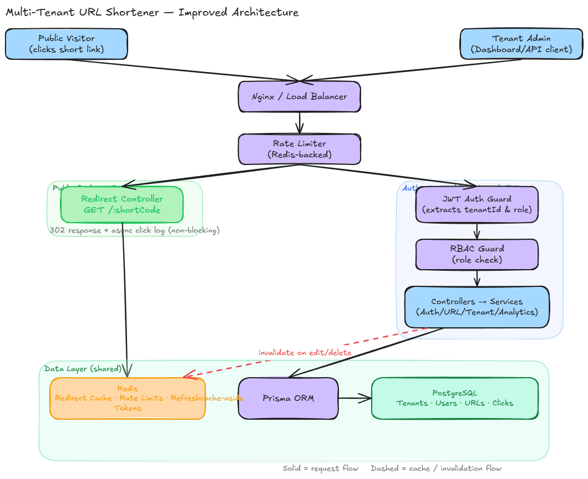

# URL Shortener Platform

A multi-tenant URL shortening and analytics platform. Each tenant manages
its own short links, users, and click analytics, fully isolated from every
other tenant on shared infrastructure.

## Features

- Tenant-scoped URL creation, management, and redirection
- Per-tenant click analytics
- Role-based access within each tenant
- JWT-based authentication with short-lived access tokens and rotating refresh tokens
- Row-level tenant isolation on a shared database

## Tech Stack

| Layer    | Choice                    |
| -------- | ------------------------- |
| Backend  | NestJS, TypeScript        |
| Database | PostgreSQL via Prisma ORM |
| Cache    | Redis                     |
| Frontend | React, Vite, TypeScript   |
| Auth     | JWT                       |

## Architecture at a Glance



Requests pass through an ordered guard chain (authentication, tenant
resolution, authorization) before reaching business logic; public
redirects follow a separate, unauthenticated, cache-first path. Full
breakdown in [`docs/architecture/overview.md`](./docs/architecture/overview.md).

## Installation

```bash
git clone <repo-url>
cd url-shortener-platform
npm install
```

This is an npm workspaces monorepo. One install at the root covers both
`backend` and `frontend`.

## Environment Setup

> **Start order matters.** Docker must be running and the containers must be
> healthy before starting the backend. If the backend starts without Postgres
> or Redis, it exits immediately and all API calls will fail.

```bash
docker compose up -d   # start Postgres + Redis first
docker compose ps      # wait until both show (healthy)
```

Then copy the environment files:

```bash
cp backend/.env.example backend/.env
cp frontend/.env.example frontend/.env
```

Apply the Prisma schema and seed the development accounts:

```bash
npm run db:push   # creates/updates tables and enums in Postgres
npm run seed      # creates the tenant and user accounts listed below
```

> **Re-run `db:push` after schema changes.** When you pull commits that update
> `backend/prisma/schema.prisma` (new models, new enum values, etc.), run
> `npm run db:push` again to sync the database before starting the backend.
> Skipping this causes runtime errors such as
> `invalid input value for enum "Role"` when the seed or the API tries to
> insert a value the database does not yet recognise.

### Seed accounts

| Role | Email | Password |
| ----------- | ----------------------------- | ---------------- |
| TENANT_ADMIN | `dev@example.com` | `devpassword123` |
| SUPER_ADMIN | `superadmin@platform.com` | `superadmin123` |

### Environment variables

#### `frontend/.env`

| Variable | Default | Purpose |
| -------------------------------- | ------------------------- | ---------------------------------------------------------------- |
| `VITE_API_BASE_URL` | `/api/v1` | Prefix for all API calls. The Vite proxy forwards to port 3000. |
| `VITE_SHORT_LINK_BASE_URL` | `http://localhost:3000` | Base URL prepended to short codes in the UI (e.g. the copy button). Must point to the NestJS backend, **not** the Vite dev server (port 5173). In production set this to your public domain. |

#### `backend/.env`

See `backend/.env.example` for a full annotated list. The notable variable
for multi-machine setups:

| Variable | Notes |
| -------------- | ---------------------------------------------------------------------------------------------------- |
| `DATABASE_URL` | `docker-compose.yml` maps host **5433** → container 5432. Use port 5433 when connecting to Docker Postgres. If you have a native Postgres on port 5432, use port 5432. |

## Local Infrastructure

Postgres and Redis run in Docker; the backend and frontend run natively
(`npm run dev:*`) for fast reload during development.

```bash
docker compose up -d      # start Postgres + Redis
docker compose ps         # check health status
docker compose down       # stop containers (data persists in named volumes)
docker compose down -v    # stop containers and delete all data
```

If `npm run db:push` reports possible data loss, the target database already
contains an older or incompatible schema. For local development, use a fresh
database volume with `docker compose down -v && docker compose up -d`, then run
`npm run db:push` again. Do not pass Prisma's data-loss override against a
database that contains data you need to keep.

## Running Locally

```bash
npm run dev:backend   # NestJS API at http://127.0.0.1:3000
npm run dev:frontend  # Vite dev server at http://127.0.0.1:5173
```

The frontend at port 5173 proxies `/api/*` to the backend at port 3000.
Short-link redirects (`GET /:shortCode`) are handled by the backend on
port 3000 — not the Vite dev server. Clicking a copied short URL in the
browser must target port 3000, which `VITE_SHORT_LINK_BASE_URL` ensures.

## Useful Scripts

| Command                  | Description                |
| ------------------------- | --------------------------- |
| `npm run build`           | Build both apps             |
| `npm run build:backend`   | Build the API only          |
| `npm run build:frontend`  | Build the frontend only     |
| `npm run lint`            | Lint both apps               |
| `npm run format`          | Format source with Prettier |
| `npm run test`            | Run backend unit tests       |
| `npm run db:push`         | Apply the Prisma schema      |
| `npm run seed`            | Seed the local test user     |

## Folder Navigation

```
backend/      NestJS API; see backend/src for module layout
frontend/     React dashboard
docs/         Architecture, design decisions, and concept documentation
docker-compose.yml   Local Postgres + Redis for development
```

## Documentation

Setup and scripts stop here. System design documentation lives in
[`docs/`](./docs/README.md):

- [Why URL Shorteners Exist](./docs/concepts/url-shorteners.md)
- [Why Multi-Tenancy](./docs/concepts/multi-tenancy.md)
- [System Architecture](./docs/architecture/overview.md)
- [Request Lifecycle](./docs/architecture/request-lifecycle.md)
- [Redirect Flow](./docs/architecture/redirect-flow.md)
- [URL Management](./docs/architecture/url-management.md)
- [Caching Strategy](./docs/architecture/caching-strategy.md)
- [Analytics Flow](./docs/architecture/analytics-flow.md)
- [Authentication Flow](./docs/architecture/authentication-flow.md)
- [Tenant Isolation](./docs/architecture/tenant-isolation.md)
- [Design Decisions](./docs/architecture/decisions.md)
- [Future Improvements](./docs/future-improvements.md)